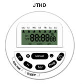
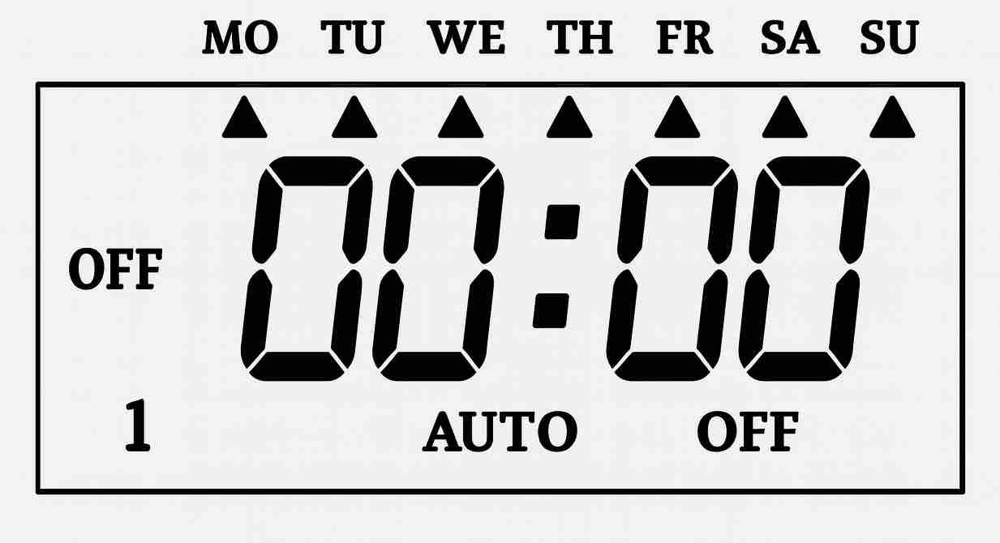
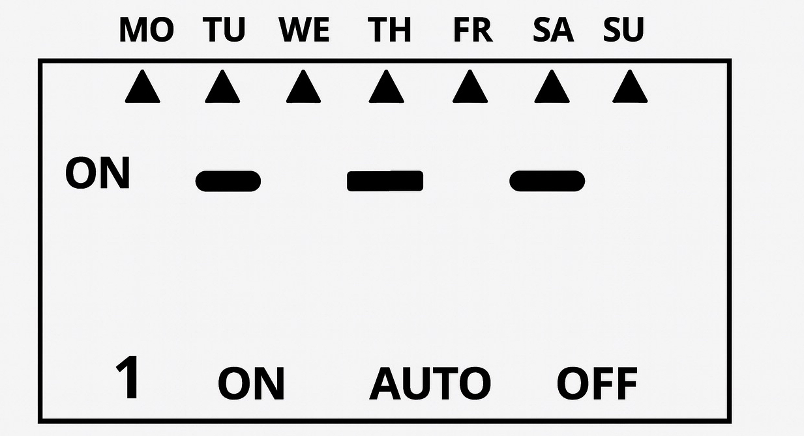
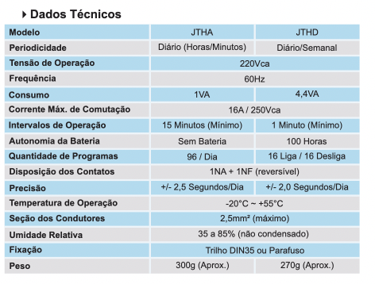
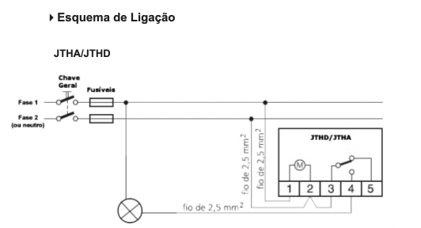

## CEFET-MG
## DEE- CURSO DE ELETROTÉCNICA
## PLIEP
## Guia de Aula – Programador Horário Digital 

Os programadores horários digitais são dispositivos fundamentais em sistemas de automação residencial, comercial e industrial. Eles permitem o **acionamento e desligamento automático de cargas elétricas** com base em horários definidos pelo usuário, garantindo maior eficiência, economia de energia e segurança operacional.


## Sumário

- [1. Introdução ao Programador Horário Digital](#1-introdução-ao-programador-horário-digital)
  - [Exemplos de Aplicações](#exemplos-de-aplicações)

- [2. Operação do Equipamento](#2-operação-do-equipamento)
  - [Tabela de Botões e Funções](#tabela-de-botões-e-funções--programador-digital-jng)
  - [Elementos Impressos no Painel](#elementos-impressos-no-painel)

- [3. Especificações Técnicas](#3-especificações-técnicas)

- [4. Funcionamento Básico](#4-funcionamento-básico)
  - [Operações Programáveis](#operações-programáveis)

- [5. Instalação e Cuidados](#5-instalação-e-cuidados)
  - [5.1 Local de Instalação](#51-local-de-instalação)
  - [5.2 Procedimento Básico](#52-procedimento-básico)

- [6. Programação de Horário](#6-programação-de-horário)
  - [6.1 Ajuste Inicial do Relógio](#61-ajuste-inicial-do-relógio)
  - [6.2 Programando Horários de Ligar e Desligar](#62-programando-horários-de-ligar-e-desligar)
    - [6.2.1 Entrar no modo de programação](#621-entrar-no-modo-de-programação)
    - [6.2.2 Programar Horário de Ligar (1 ON)](#622-programar-o-horário-de-ligar-1-on)
    - [6.2.3 Programar Horário de Desligar (1 OFF)](#623-programar-o-horário-de-desligar-1-off)
    - [6.2.4 Criar Ciclos Adicionais](#624-criar-ciclos-adicionais)
  - [6.3 Modos de Funcionamento](#63-modos-de-funcionamento)
  - [6.4 Finalizar e Salvar](#64-finalizar-e-salvar)
  - [6.5 Teste](#65-teste)
  - [Exemplo Completo de Programação](#exemplo-de-programação)

- [7. Aplicações Didáticas](#7-aplicações-didáticas)


## 1. Introdução ao Programador Horário Digital

O **Programador Horário Digital TH190 (220V)** é um dispositivo utilizado para o **controle automático de cargas elétricas**, baseado em horários definidos pelo usuário. Ele automatiza rotinas de acionamento e desligamento, sem necessidade de intervenção manual. Existem versões analógicas e digitais do mesmo equipamento.


Benefícios principais:
- Redução do consumo de energia.
- Maior vida útil dos equipamentos.
- Automação regular e precisa de rotinas elétricas.
- Segurança operacional.

### Exemplos de Aplicações

- Controle de iluminação interna e externa.
- Automação de bombas d’água.
- Sistemas de irrigação.
- Equipamentos de ventilação/exaustão.
- Sistemas industriais de baixa potência.

---

## 2. Operação do  Equipamento

O TH190 executa **ciclos programados de liga/desliga**, sendo útil em sistemas que necessitam:
- Funcionamento em horários específicos;
- Repetição diária ou semanal;
- Automatização de processos sem supervisão constante.



### Tabela de Botões e Funções – Programador Digital JNG



| Botão | Nome Impresso | Função Principal |
|-------|----------------|------------------|
| **D** | Day (Dia) | Ajusta o **dia da semana** (MO, TU, WE, TH, FR, SA, SU). |
| **H** | Hour (Hora) | Ajusta a **hora** tanto no relógio quanto na programação ON/OFF. |
| **Min** | Minute (Minuto) | Ajusta os **minutos** do relógio e das programações. |
| **Manual** | Manual | Alterna entre **AUTO**, **ON** (ligado fixo) e **OFF** (desligado fixo). |
| **C** | Clock | Usado para **configurar o relógio**, e para retornar ao modo horário. |
| **Prog** | Program | Entra no modo de **programação ON/OFF**, permite configurar até 16 ciclos. |

### Elementos Impressos no Painel



| Elemento | Significado |
|----------|-------------|
| **MO TU WE TH FR SA SU** | Indicação dos dias da semana no display. |
| **SUM.TIME** | Função de ajuste de Horário de Verão (nem sempre ativa). |
| **SLEEP** | Função de economia de energia (desliga o display após inatividade). |
| **Display LCD** | Exibe hora, ciclos ON/OFF, modo AUTO/ON/OFF e dia da semana. |


---

## 3. Especificações Técnicas

| Parâmetro                       | Descrição                                |
|--------------------------------|--------------------------------------------|
| **Modelo**                     | TH190                                      |
| **Tensão de operação**         | 220 V AC                                   |
| **Frequência**                 | 50/60 Hz                                   |
| **Tipo**                       | Programador horário digital                |
| **Instalação**                 | Painéis elétricos / caixas de comando      |
| **Aplicações**                 | Iluminação, bombas e sistemas de automação |



> Observação: utilizar conforme normas aplicáveis, como **NBR 5410**.

---

## 4. Funcionamento Básico

O TH190 opera através de:
1. **Relógio digital interno** para contagem de tempo.
2. **Relé de saída** que comuta a carga conforme programação.
3. **Interface de configuração** com display e teclas.

### Operações Programáveis
- Definir horário de ligar (ON).
- Definir horário de desligar (OFF).
- Repetição diária/semanal.
- Modo manual para testes.

---

## 5. Instalação e Cuidados


### 5.1 Local de Instalação  
- Painéis elétricos, quadros de comando ou caixas de distribuição.  
- Ambientes sem umidade ou calor excessivo.  
- Em trilho DIN, quando aplicável.

### 5.2 Procedimento Básico  
> Instalação deve ser realizada por profissional qualificado.
> 


1. Desenergizar o circuito.
2. Instalar conforme diagrama e conectar alimentação 220V.
3. Ligar a carga nos bornes do relé.
4. Conferir o aperto dos terminais.
5. Programar data e hora.
6. Inserir os horários desejados.

---

## 6. Programação de Horário 

## 🕒 6.1. Ajuste Inicial do Relógio

Antes de programar os ciclos ON/OFF, configure o horário interno.

1. Pressione e segure **CLOCK**.  
2. Mantendo CLOCK pressionado:
   - Ajuste a **hora** com o botão **HOUR**.  
   - Ajuste os **minutos** com **MINUTE**.  
   - Ajuste o **dia da semana** com **WEEK**.  
3. Solte **CLOCK**.

## ⏱️ 6.2. Programando Horários de Ligar e Desligar

Cada ciclo é formado por:
- **ON** → Horário em que o equipamento liga  
- **OFF** → Horário em que o equipamento desliga  

O TH190 aceita até **16 ciclos**.

### ▶️ 6.2.1 Entrar no modo de programação

Pressione **PROG** até aparecer:

```
1 ON
```

### 🔧 6.2.2 Programar o horário de LIGAR (1 ON)

Use os botões:
- **HOUR**
- **MINUTE**
- **WEEK**

### 🔧 6.2.3 Programar o horário de DESLIGAR (1 OFF)

Pressione **PROG** novamente e ajuste.

### ➕ 6.2.4 Criar ciclos adicionais

Continue pressionando **PROG** para acessar novos ciclos.

## 🔄 6.3. Modos de Funcionamento

- **AUTO**
- **ON**
- **OFF**

Use **AUTO** para executar a programação.

## ✔️ 6.4. Finalizar e Salvar

Pressione **CLOCK** para retornar ao relógio.

## 🧪 6.5. Teste

Deixe em AUTO e aguarde o horário programado.

## 📘 Exemplo de Programação

Ligar às 18:00 e desligar às 23:00.

1. PROG → 1 ON  
2. PROG → 1 OFF  
3. CLOCK → sair  
4. MANUAL → AUTO

---

## 7. Aplicações Didáticas

Sugestões para aula prática:
- Mostrar exemplos reais de uso (iluminação, bombas, irrigação).
- Simular erros de programação.
- Comparar consumo com e sem automação.
- Relacionar com automação industrial (CLP, IoT).

---
